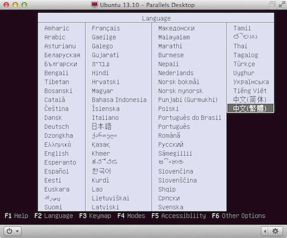
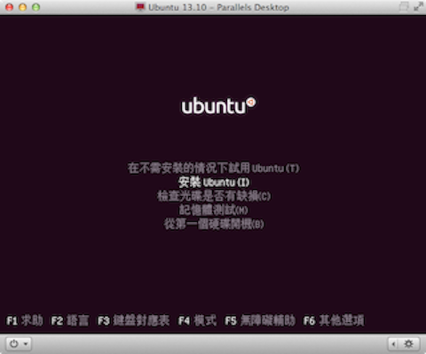
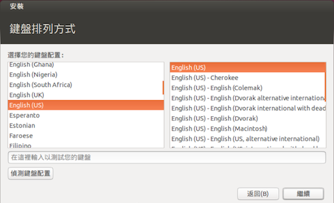
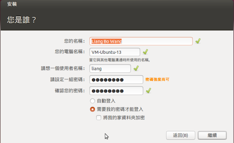
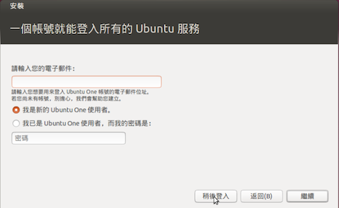
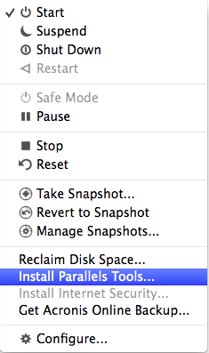
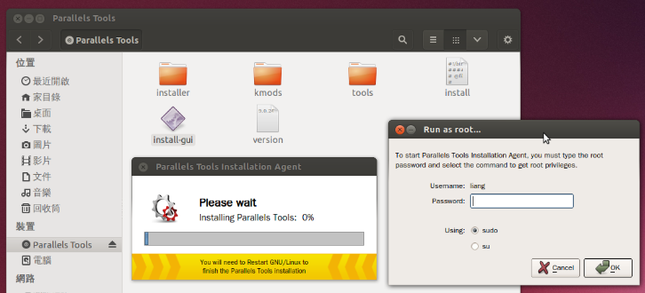
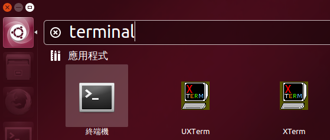

# Ubuntu 13.10 完全自行安裝 Stey-by-step 說明

從網路下載安裝，選擇中文（繁體），並選擇「安裝 Ubuntu」




接下來基本上按照指示下一步即可。Ubuntu One 此服務可以略過不填。帳號這邊是以我自己的名字為例。





重開機後就完成了 Ubuntu 13.10 的安裝。

### 使用 Parallels (Mac) 上安裝 Parallels Tools



點擊之後 Ubuntu 會多出一個 CD 裝置「Parallels Tools」，點擊 `install-gui` 會要求輸入各位帳號的密碼。



完成安裝後會要求重新啟動，這時跟 mac 的整合會更好，螢幕解析度會提昇。


# 系統環境基本設定

## 釘選終端機至側邊欄

終端機很常使用，可以點第一項（相當於 Windows 的開始按鈕）後，搜尋「terminal」找到「終端機」後點擊



開啟終端機後它的 icon 會跑到側邊欄，可以把它釘選，這樣未來就不用一直找它。


## 更新套件

```
sudo agt-get update
sudo apt-get upgrade  # 選 Y 更新
```

## 安裝 google chrome

設定 Google Linux PPA

```
wget -q -O - https://dl-ssl.google.com/linux/linux_signing_key.pub | sudo apt-key add -
sudo sh -c 'echo "deb http://dl.google.com/linux/chrome/deb/ stable main" >> /etc/apt/sources.list.d/google-chrome.list'
```

```
sudo apt-get update
sudo apt-get install google-chrome-stable
```

## 基本編譯工具

這些工具沒有的話，編譯動作會很麻煩

```
sudo apt-get install build-essential git xz-utils
```

# OpenSSH server

用指令列連進主機

```
sudo apt-get install openssh-server
```

修改 `/etc/ssh/sshd_config` 中一行

```
PermitRootLogin no
```

重新啟動服務

```
sudo service ssh restart
```


# Compile Python 2.7.6 on Ubuntu

我習慣自己 compile 一個跟系統獨立

```bash
$ sudo apt-get install libncursesw5-dev libncurses-dev libreadline-dev libssl-dev libgdbm-dev libc6-dev libsqlite3-dev tk-dev libbz2-dev liblzma-dev
```

```bash
$ cd /tmp
$ wget http://python.org/ftp/python/2.7.6/Python-2.7.6.tar.xz
$ tar Jxvf Python-2.7.6.tar.xz
$ cd Python-2.7.6
$ ./configure --enable-shared
$ make
$ sudo make install
```

## Setuptools

```
$ wget https://bitbucket.org/pypa/setuptools/raw/bootstrap/ez_setup.py
$ sudo /usr/local/bin/python ez_setup.py
$ sudo /usr/local/bin/easy_install pip
```

## Numpy

```
$ sudo apt-get install liblapack-dev libatlas-base-dev gfortran
$ sudo pip-2.7 install numpy
```

## IPython

```
$ sudo easy_install-2.7 ipython[all]
```


# R 3.0.x on Ubuntu

add deb to `sources.list` by `sudo vim /etc/apt/sources.list`

```
## R-related deb
deb http://cran.csie.ntu.edu.tw/bin/linux/ubuntu raring/
```

```bash
# add key to sign CRAN packages
sudo apt-key adv --keyserver keyserver.ubuntu.com --recv-keys E084DAB9
sudo add-apt-repository ppa:marutter/rdev

sudo apt-get update
sudo apt-get install r-base
```

# Tex Live 2013

- Bundled <https://github.com/scottkosty/install-tl-ubuntu>
- Vanilla Tex Live <http://tex.stackexchange.com/questions/1092>

```
git clone https://github.com/scottkosty/install-tl-ubuntu
cd install-tl-ubuntu
git checkout devel
sudo ./install-tl-ubuntu
sudo apt-get install texmaker  # for latex editor
```

## Fonts

Opentype, put them under `/usr/share/fonts/opentype`. Then run

```bash
sudo fc-cache -vf
```
